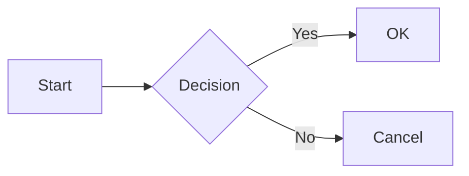
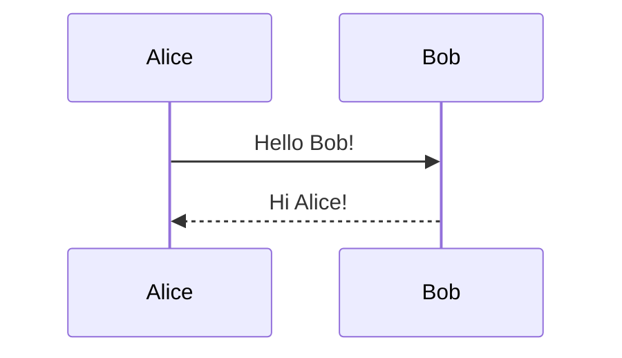

# BarkDown Wiki

Welcome to the BarkDown documentation! This guide covers everything you need to know about using BarkDown - your markdown's best friend.

## Table of Contents

- [Getting Started](#getting-started)
- [Features](#features)
- [Keyboard Shortcuts](#keyboard-shortcuts)
- [Themes](#themes)
- [Math Rendering](#math-rendering)
- [Mermaid Diagrams](#mermaid-diagrams)
- [Configuration Options](#configuration-options)
- [Troubleshooting](#troubleshooting)
- [FAQ](#faq)

---

## Getting Started

### Installation

1. Clone or download the repository:
   ```bash
   git clone https://github.com/raggle/barkdown.git
   ```

2. Open Chrome and navigate to `chrome://extensions`

3. Enable "Developer mode" (toggle in top right)

4. Click "Load unpacked" and select the `barkdown` folder

5. Enable "Allow access to file URLs" in the extension details

### First Use

Simply open any markdown file (`.md`, `.markdown`, etc.) in Chrome. BarkDown will automatically render it as beautiful HTML.

---

## Features

### Auto-Reload

BarkDown watches your files and automatically refreshes the preview when changes are detected.

**Configuration:**
- Enable/disable in Options
- Adjustable refresh interval (1-5 seconds)

### Dark Mode

Toggle between light and dark themes with the sun/moon button in the top-right corner. Your preference is saved automatically.

### Copy Code Button

Hover over any code block to reveal a "Copy" button. Click to copy the code to your clipboard.

### Line Numbers

Code blocks automatically display line numbers for easier reference.

### Heading Anchors

Hover over any heading to reveal a link icon. Click to copy a direct link to that section.

### Task List Progress

Task lists display a progress bar showing completion status:
```markdown
- [x] Completed task
- [ ] Pending task
```

### Reading Time

Displays estimated reading time based on word count (200 words/minute average).

### Image Lightbox

Click any image to view it in a full-screen lightbox. Press `Esc` or click outside to close.

### Focus Mode

Click the focus button (or press `F`) to dim surrounding content and highlight only the paragraph under your cursor.

### Font Size Controls

Adjust text size with the A-/A/A+ buttons in the top-right corner. Your preference is saved.

### Reading Progress

A progress bar at the top of the page shows how far you've scrolled through the document.

### Back to Top

A floating button appears when you scroll down. Click to smoothly scroll back to the top.

### PDF Export

Click the "PDF" button or press `Ctrl/Cmd + P` to print or save as PDF.

---

## Keyboard Shortcuts

| Key | Action |
|-----|--------|
| `/` | Open search overlay |
| `t` | Scroll to top |
| `b` | Scroll to bottom |
| `f` | Toggle focus mode |
| `Esc` | Close lightbox/search |
| `Enter` | Jump to next search result (in search) |
| `Ctrl/Cmd + P` | Print / Export PDF |

---

## Themes

### Built-in Themes

BarkDown includes several themes:

- **Github** - Clean GitHub-style rendering (default)
- **GithubLeft** - GitHub style, left-aligned
- **Clearness** - Light, minimal theme
- **ClearnessDark** - Dark variant of Clearness
- **ClearnessDarkLg** - Large text dark theme
- **TopMarks** - Academic-style theme
- **YetAnotherGithub** - Alternative GitHub style

### Custom CSS

You can add custom CSS in two ways:

1. **Upload a CSS file** - In Options, use the file picker
2. **External URL** - Enter the URL of a hosted CSS file

### Per-Page Themes

Use the popup menu to set a specific theme for individual pages. This overrides the default theme.

---

## Math Rendering

BarkDown uses KaTeX for fast, beautiful math rendering.

### Inline Math

```markdown
Inline: $E = mc^2$
Or: \\(E = mc^2\\)
```

### Display Math

```markdown
$$
\frac{n!}{k!(n-k)!} = \binom{n}{k}
$$
```

Or use a math code block:

````markdown
```math
\int_0^\infty e^{-x^2} dx = \frac{\sqrt{\pi}}{2}
```
````

### LaTeX Delimiters

By default, single-backslash delimiters (`\(`, `\)`, `\[`, `\]`) and single dollar signs are disabled to avoid conflicts with markdown. Enable them in Options if needed.

---

## Mermaid Diagrams

BarkDown supports Mermaid diagrams for flowcharts, sequence diagrams, and more.

### Flowchart

````markdown

````

### Sequence Diagram

````markdown

````

### Supported Diagram Types

- Flowcharts
- Sequence diagrams
- Class diagrams
- State diagrams
- Entity Relationship diagrams
- Gantt charts
- Pie charts
- Git graphs
- Mindmaps
- Timelines

See [test/test_mermaid_examples.md](../test/test_mermaid_examples.md) for complete examples.

---

## Configuration Options

Access options by clicking the BarkDown icon and selecting "Options", or right-click the extension icon.

### Permissions

- **Allow access to all websites** - Required for rendering markdown from web URLs (e.g., raw.githubusercontent.com)

### Features

- **Mermaid & KaTeX support** - Enable/disable math and diagram rendering
- **Auto-reload** - Automatically refresh when files change
- **Table of Contents** - Show/hide the TOC sidebar

### Reload Frequency

How often BarkDown checks for file changes (1-5 seconds).

### Supported Extensions

Choose which file extensions BarkDown should render:
- `.md` (default)
- `.markdown`
- `.mdown`
- `.mkd`
- `.text`
- `.txt`
- `.rst`
- `.rmd`

---

## Troubleshooting

### Markdown file shows as plain text

1. Check that "Allow access to file URLs" is enabled
2. Verify the file extension is in the supported list
3. Try refreshing the page

### Math equations not rendering

1. Ensure KaTeX is enabled in Options
2. Check your syntax matches the supported formats
3. Try using double-backslash delimiters (`\\(` instead of `\(`)

### Mermaid diagrams not appearing

1. KaTeX option must be enabled (it enables both math and diagrams)
2. Ensure the code block is marked as `mermaid`
3. Check browser console for syntax errors

### Auto-reload not working

1. Verify auto-reload is enabled in Options
2. File must be a local file (not a web URL)
3. Try increasing the reload frequency

### Custom theme not loading

1. Check that the CSS file URL is accessible
2. Ensure the URL uses HTTPS
3. Try uploading the file directly instead

---

## FAQ

**Q: Is BarkDown available on the Chrome Web Store?**

A: Not yet. Currently, BarkDown must be installed manually in developer mode. We plan to publish to the Web Store in the future.

**Q: Does BarkDown work with Firefox/Safari/Edge?**

A: BarkDown is currently Chrome-only. Firefox support may be added in the future.

**Q: Can I use BarkDown offline?**

A: Yes! BarkDown works entirely offline for local files. Only web-hosted markdown requires an internet connection.

**Q: How do I report a bug or request a feature?**

A: Open an issue on our [GitHub repository](https://github.com/raggle/barkdown/issues).

**Q: Why "BarkDown"?**

A: BarkDown is a pun on "Markdown" with a dog theme, reflecting our parent company Raggle's dog mascot. Like a loyal pup, BarkDown fetches your markdown and delivers a beautiful preview!

---

## Credits

BarkDown is built with these open source projects:

- [Marked](https://github.com/markedjs/marked) - Markdown parser
- [KaTeX](https://katex.org/) - Math rendering
- [Mermaid](https://mermaid.js.org/) - Diagrams
- [highlight.js](https://highlightjs.org/) - Syntax highlighting
- [DOMPurify](https://github.com/cure53/DOMPurify) - XSS protection

---

*Made with tail wags by [Raggle](https://raggle.co)*
