# Mermaid Diagram Examples

This document showcases various Mermaid diagram types supported by BarkDown.
Based on [GitHub's Mermaid support](https://github.blog/developer-skills/github/include-diagrams-markdown-files-mermaid/).

---

## 1. Simple Flowchart

A basic directed graph showing connections between nodes:

## 2. Flowchart with Labels

Flowchart with descriptive labels and different node shapes:

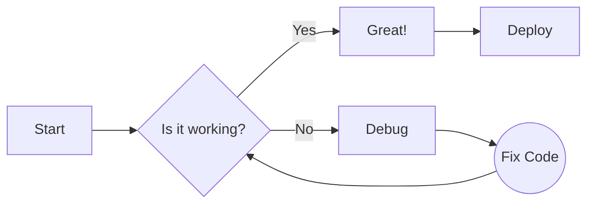

## 3. Flowchart Direction Variants

### Top to Bottom (TB)
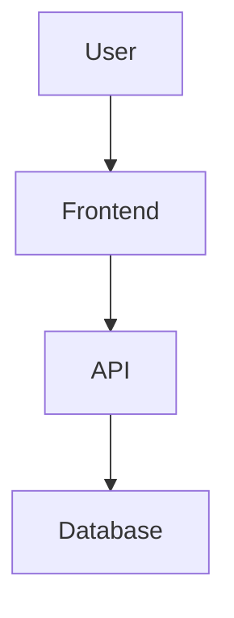

### Left to Right (LR)
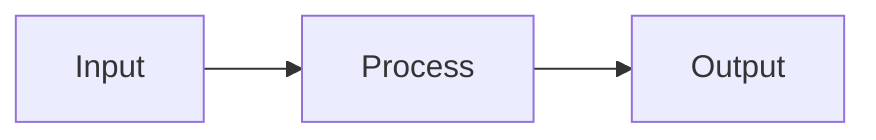

## 4. Sequence Diagram

Shows interactions between participants over time:

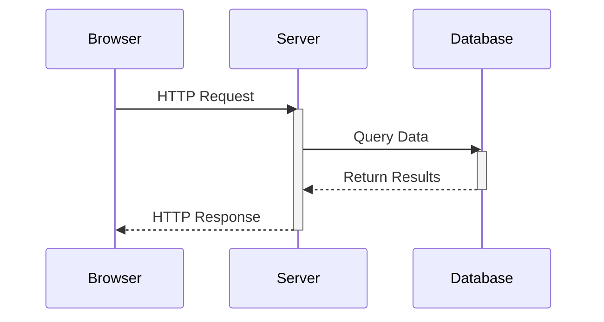

## 5. Sequence Diagram with Notes and Loops

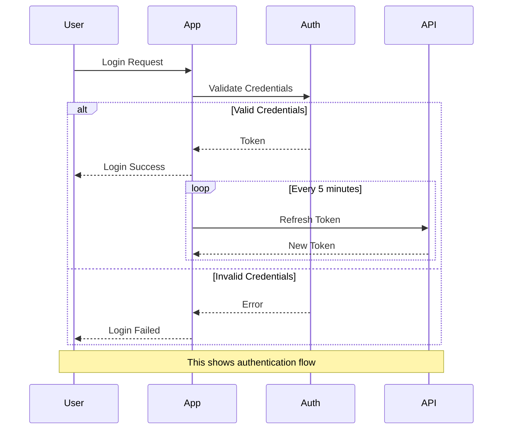

## 6. Class Diagram

UML class diagram showing relationships:

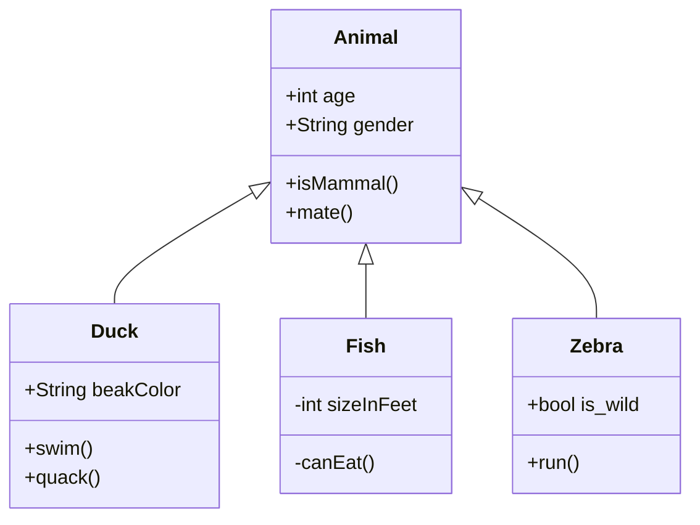

## 7. State Diagram

Shows state transitions:

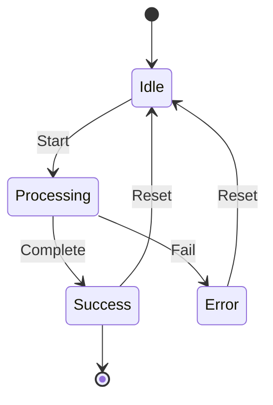

## 8. Entity Relationship Diagram

Database ER diagram:

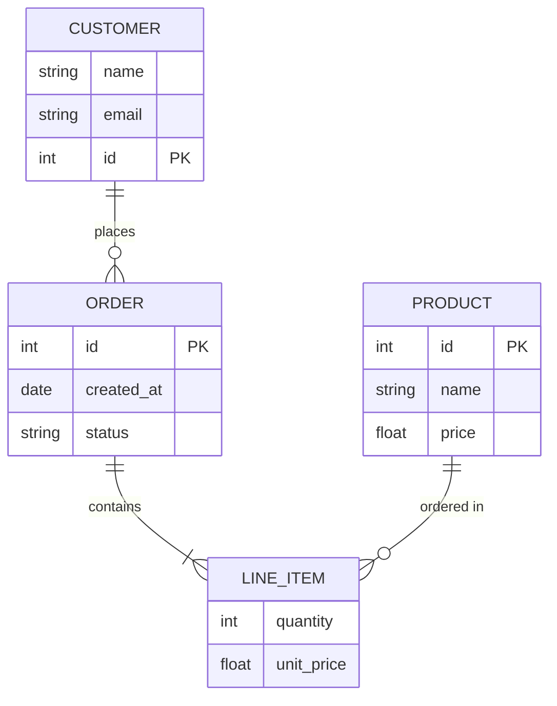

## 9. Gantt Chart

Project timeline visualization:

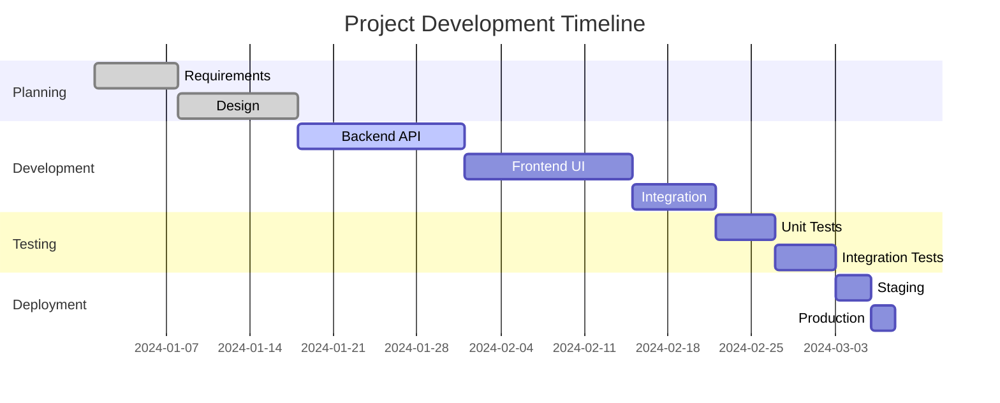

## 10. Pie Chart

Simple pie chart:

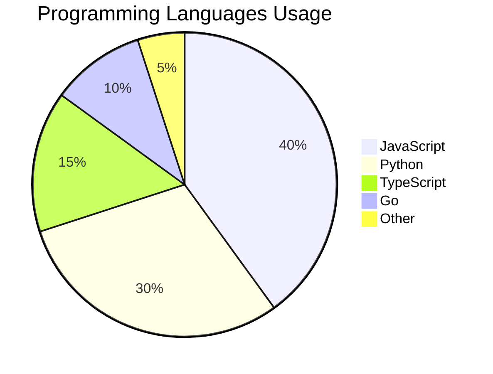

## 11. User Journey Diagram

Customer experience mapping:

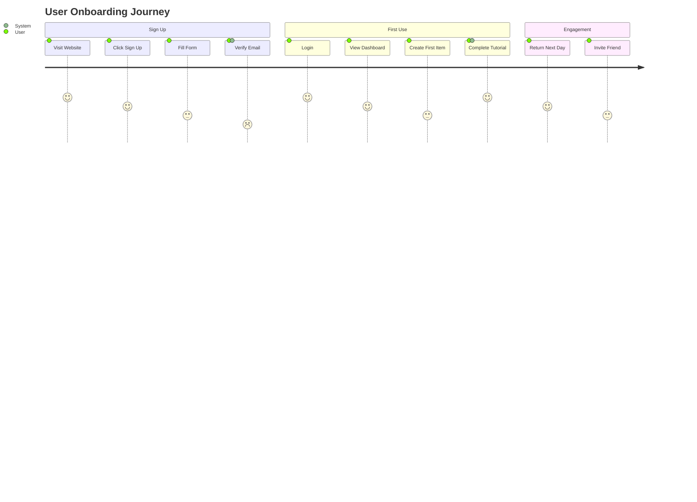

## 12. Git Graph

Visualize git branching:

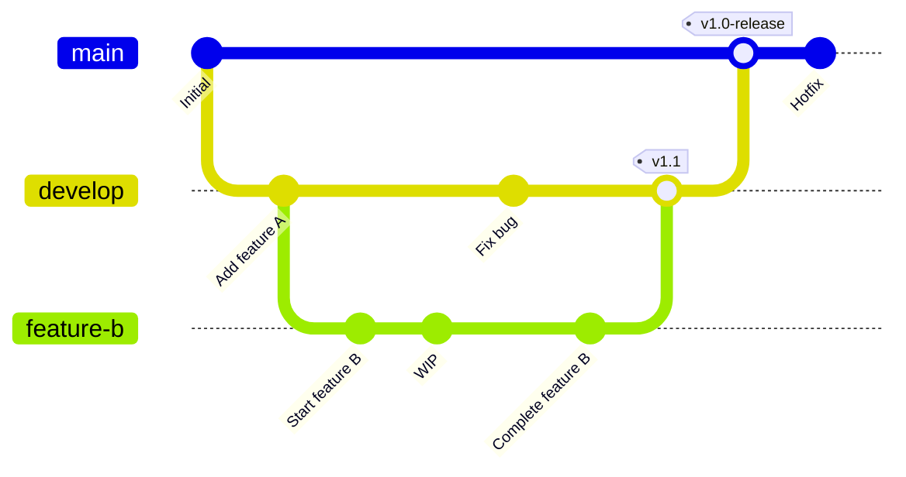

## 13. Mindmap

Hierarchical concept visualization:

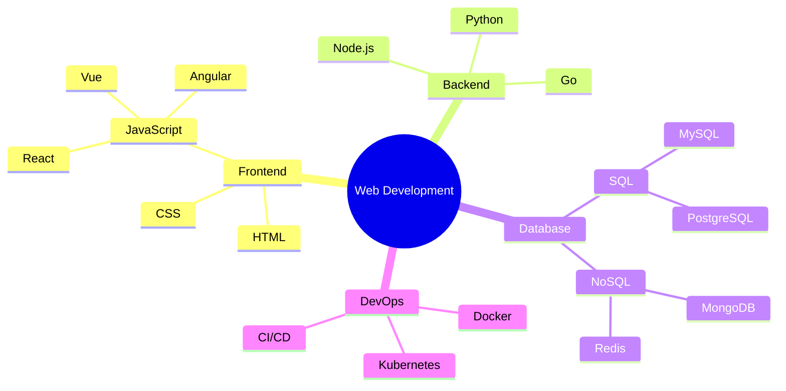

## 14. Timeline

Historical or event timeline:

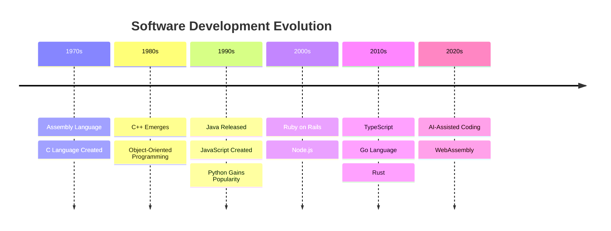

## 15. Quadrant Chart

Position mapping on two axes:

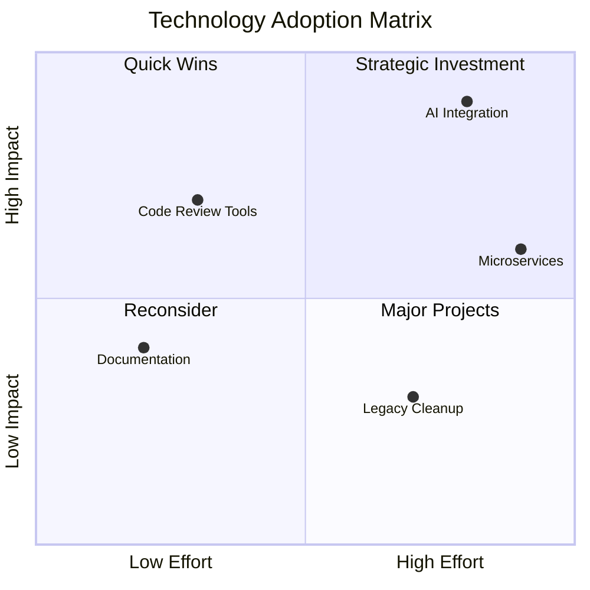

## 16. Flowchart with Styling

Custom styled flowchart:

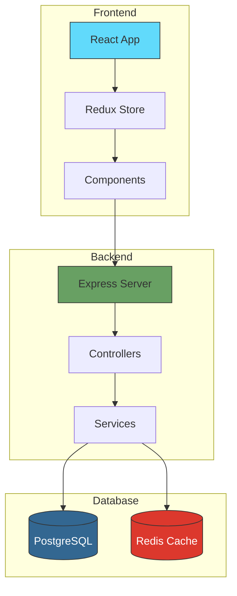

---

## Notes

- Mermaid diagrams are rendered client-side using the mermaid.js library
- The `katex` option must be enabled in extension settings for diagram rendering
- Some newer diagram types may require updated mermaid.js versions
- Diagrams are responsive and render as SVG for crisp display at any size
